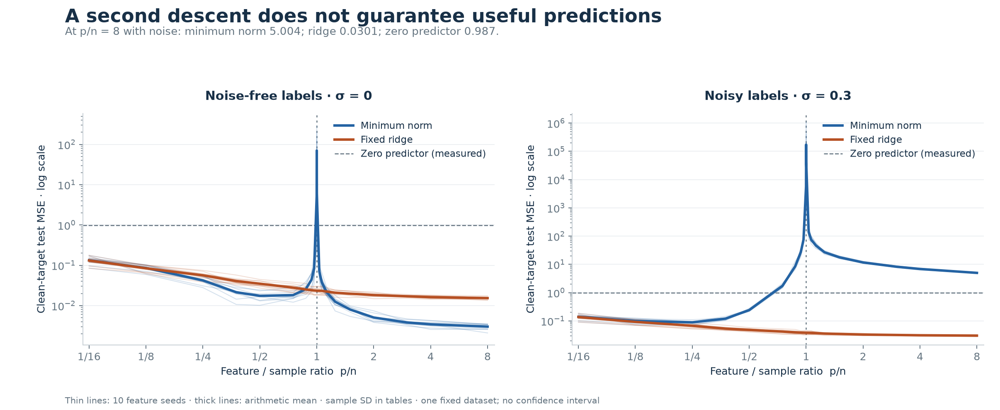

# Random-Feature Double Descent

**The second descent appeared. With noisy labels, it still lost to predicting zero.**

A controlled PyTorch study of prediction error, interpolation and numerical conditioning in random Fourier regression. The output coefficients are solved directly with SVD; there are no epochs or learned feature weights.

**GitHub repository:** [gour6380/Random-Feature-Double-Descent](https://github.com/gour6380/Random-Feature-Double-Descent)

[Technical report](results/run_001/technical_report.md) · [Executed notebook](notebooks/random_feature_double_descent.ipynb) · [Measured results](results/run_001/README.md) · [Protocol](docs/expanded-protocol.md) · [MIT license](LICENSE)

Read the [full technical report on GitHub](https://github.com/gour6380/Random-Feature-Double-Descent/blob/main/results/run_001/technical_report.md) for the protocol, all eight figures, seed variability, numerical diagnostics and limitations. The [local report](results/run_001/technical_report.md) contains the same document for downloaded checkouts.



## What happened

The completed study covers **1,024 training examples, 21 feature counts, ten feature seeds, 210 decompositions and 840 evaluated predictors**. Every registered primary predictor completed. An additional 840 numerical-cutoff variants reuse the same decompositions.

Mean test MSE against the **clean target function**, over ten feature seeds:

| Training labels / estimator | 256 features | 1,024 features | 8,192 features |
|---|---:|---:|---:|
| Noiseless / minimum norm | 0.04229 | 70.61229 | **0.00301** |
| Noisy, σ = 0.3 / minimum norm | 0.08869 | **172,947.50959** | 5.00435 |
| Noisy, σ = 0.3 / fixed ridge | 0.06743 | 0.03798 | **0.03012** |

All minimum-norm seeds first met the numerical interpolation criterion at **1,024 features**. Error rose sharply near that boundary and then decreased. In the noisy condition, the largest minimum-norm model remained worse than the measured zero-prediction baseline (**0.98713** MSE). Ridge suppressed the spike. With noiseless labels, minimum norm ultimately did better than the fixed ridge comparator: **0.00301 versus 0.01535** MSE at 8,192 features.

Peak height is highly variable: noisy minimum-norm MSE at the boundary has mean **172,947.51**, sample SD **350,267.77** and median **16,256.73**. The report keeps individual seeds and extreme values visible. This is variation over random features conditional on one dataset/noise realization, not uncertainty over independent datasets.

The saved run records **61 passing correctness tests**, **zero failed predictors**, and **124.65 seconds of active execution** on an M2 Pro. That timing excludes notebook idle time and installation and is not a promise for another laptop. The current portability revision separately passes **79 regression tests** on macOS.

This is a paper-inspired adaptation of [Belkin et al.](https://arxiv.org/abs/1812.11118), [Rahimi and Recht](https://people.eecs.berkeley.edu/~brecht/papers/07.rah.rec.nips.pdf), and [Hastie et al.](https://arxiv.org/abs/1903.08560). Its evidence concerns fixed random features and linear coefficients; it does not establish how learned neural representations behave.

## Run it on your laptop

Use **Python 3.13** and [uv](https://docs.astral.sh/uv/getting-started/installation/). The measured run used Python 3.13.11. No particular environment name, username, absolute checkout path or Jupyter kernel name is required. A GPU is unnecessary: **CPU float64** is deliberate for the numerical study.

Clone the repository, then enter its directory:

```bash
git clone https://github.com/gour6380/Random-Feature-Double-Descent.git
cd Random-Feature-Double-Descent
```

Alternatively, download the repository from GitHub, extract it and open a terminal in the folder containing this README. Next, use the commands for your operating system below to create an environment, install the hashed dependencies and open the notebook. If you already have an environment, reuse its Python executable instead of creating another.

**macOS / Linux**

```bash
uv venv --python 3.13 .venv
uv pip sync --python .venv/bin/python --torch-backend cpu --require-hashes requirements.txt
.venv/bin/python -m jupyterlab notebooks/random_feature_double_descent.ipynb
```

**Windows PowerShell**

```powershell
uv venv --python 3.13 .venv
uv pip sync --python .venv\Scripts\python.exe --torch-backend cpu --require-hashes requirements.txt
.\.venv\Scripts\python.exe -m jupyterlab notebooks\random_feature_double_descent.ipynb
```

`.venv` is just an example directory. No activation step is required. The universal lock selects CPU-only PyTorch on Windows/Linux and the corresponding macOS wheel, with conditional OS dependencies. Native execution has been tested on Apple Silicon; Windows/Linux dependency resolution and CI configuration do not substitute for a completed runtime test on those systems.

In Jupyter or VS Code, select the Python interpreter from the environment you installed into. If the saved kernel name is unavailable, choose that interpreter's Python kernel; any display name works. Optional kernel registration and troubleshooting are in the [run guide](docs/reproduce.md).

1. Start with the import and configuration cells. The root is discovered from the current directory and its parents; launch Jupyter inside the project.
2. Leave `RUN_NAME = None` for a fresh run. Numbered output directories are allocated automatically.
3. Generate development data, run the explicit correctness-check cell, then inspect the timing preflight.
4. Fit the sweep, freeze identities, generate test data and evaluate. Each action has its own cell.
5. Generate tables, figures and the automatic report; optionally open TensorBoard or load a saved regressor.

**The committed notebook retains the author's original outputs and execution counts.** They are historical evidence, including local paths in some output cells. Restart the kernel and run from the top to produce your own results; viewing old outputs does not recreate the local models or data. No external dataset download is needed.

## Design and execution boundaries

| Setting | Registered value |
|---|---|
| Inputs / teacher | Eight independent Gaussian coordinates; fixed analytic unit-variance sinusoidal signal |
| Data partitions | 1,024 training / 4,096 validation / 32,768 test |
| Observation noise | σ = 0 and 0.3; paired inputs, teacher values and noise vector |
| Features | Gaussian random Fourier features, lengthscale √8, nested prefixes |
| Capacity | 21 counts from 64 to 8,192; dense sampling around 1,024 |
| Repetitions | Ten feature seeds, 2026–2035 |
| Estimators | Minimum norm with cutoff 10⁻¹²; fixed ridge λ = 10⁻⁴ under mean-squared-loss convention |
| Numerical controls | Float64 reduced SVD; actual residual/rank checks; cutoff diagnostics at 10⁻¹⁰ and 10⁻¹⁴ |
| Execution | CPU, four compute threads, 1,024-example evaluation chunks, sequential units |
| Budget | 30 minutes of active work; measured preflight and explicit budget extension only |

The notebook explicitly configures the completed protocol. The original small dataclass defaults remain documented in the [historical protocol](docs/protocol.md). Change settings before creating a fresh run and label the changed protocol separately.

Preflight measures three registered units and reuses them. A projection above budget blocks the sweep. Budget checks happen between work units, so an ongoing decomposition can finish past the deadline. No automatic grid reduction, method change or test-based selection occurs.

Fresh runs record their own environment. Resume checks protect source, configuration, data, numerical-library versions, precision and backend/thread settings. New runs ignore changes to interpreter location and unrelated installed packages. A materially different scientific environment requires a fresh run. The published historical source and execution records remain separate from the current portability revision.

## Evidence and project layout

| Path | Contents |
|---|---|
| `src/` | Configuration, synthetic data, nested features, SVD fitting, evaluation, recovery and reporting |
| `notebooks/` | Executed notebook, with saved outputs retained |
| `tests/` | Numerical, data-isolation, recovery, budget and portability regression tests |
| `results/run_001/` | Public report, exact tables, clearer figures, configuration and provenance |
| `runs/` | Local raw arrays, models, per-example predictions and logs; excluded from uploads |
| `docs/` | Protocol, setup/recovery guidance and verification records |
| `tools/` | Static checks and saved-result export/redrawing; no experiment CLI |

The public report and charts use the original saved measurements. The full local run is about 948 MiB and is excluded by `.gitignore`; the compact evidence package is included. Historical notebook plots remain unchanged, while the public figures improve legibility without discarding extreme measurements.

To check the current source locally, using your environment's Python:

```bash
python -m pytest -q tests
python tools/check_repository.py
python -m ruff check src tests tools notebooks
python -m ruff format --check src tests tools notebooks
```

Static GitHub Actions are configured for macOS, Linux and Windows. They accept saved notebook outputs and arbitrary Python kernel names; they check syntax, links and formatting without rerunning the experiment. Hosted CI has not been observed during local preparation.

See the [release notes](docs/release-notes.md) for portability changes and [verification receipt](docs/release_checks.json) for local checks. The MIT license permits reuse; cite the protocol, exact configuration and the research foundations when reporting results.
