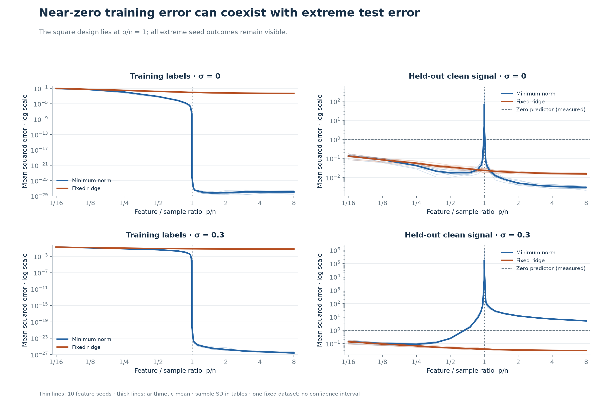
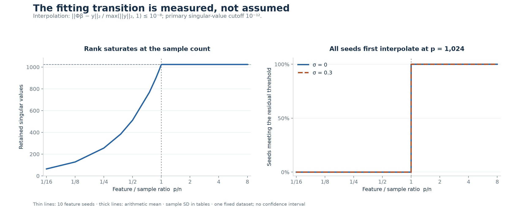
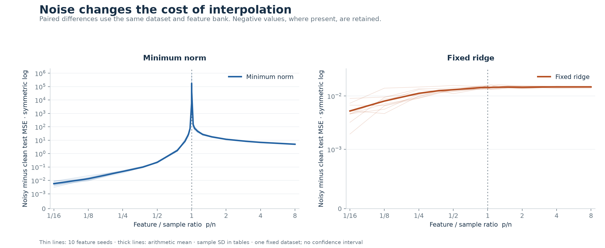
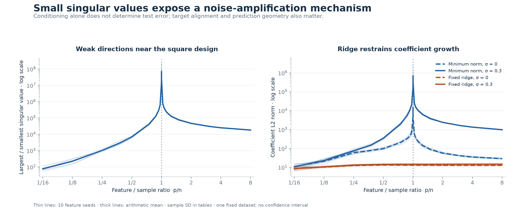
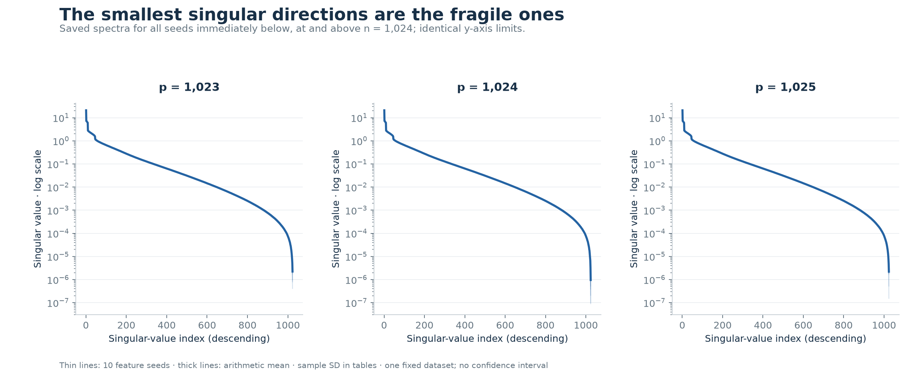
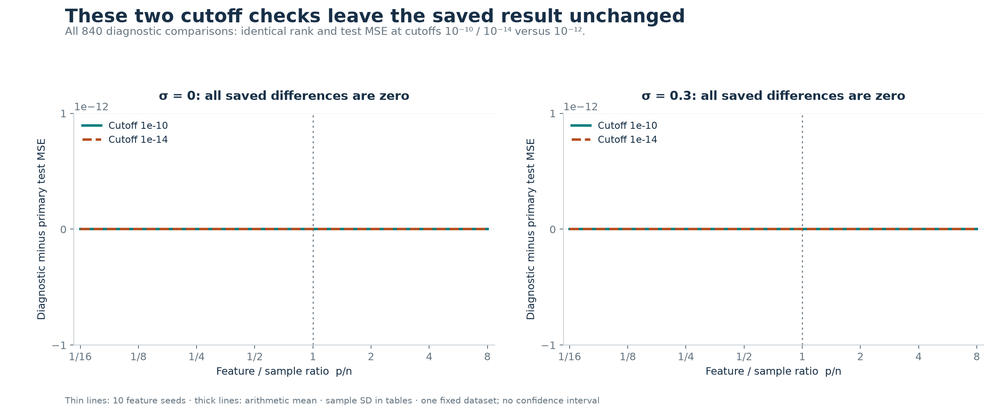
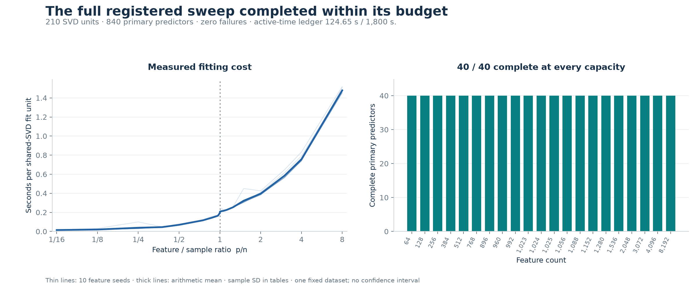

# Double descent with a costly second descent

**Random Fourier feature regression · expanded protocol 1.1 · completed 28 September 2026**

This controlled study finds a sharp test-error peak around the point where a random-feature regressor can fit all 1,024 training labels, followed by decreasing error as capacity increases. The useful result is the qualification: **with noisy labels, the second descent remains worse than predicting zero throughout the sampled overparameterized region.** One fixed ridge penalty changes that outcome substantially.

At 8,192 features, mean clean-target test MSE is **5.0044** for noisy minimum-norm regression, **0.03012** for noisy ridge and **0.98713** for the zero predictor. With noise-free labels, minimum norm instead reaches **0.003007**, outperforming ridge's **0.01535**. More capacity, exact fitting and regularization answer different questions; none is a universal guarantee of better prediction.

[Vector figure](figures/03_solver_comparison.svg) · [Individual measurements](tables/primary.csv) · [Mean and sample SD](tables/aggregate.csv)

## What was run

All **210 registered design matrices** were decomposed, producing **840 primary predictors** and **840 additional cutoff-diagnostic predictors**. All completed; no numerical failures or seed exclusions are recorded. There are no epochs, optimizer steps, learned input features or test-selected models.

| Component | Registered expanded setting |
| --- | --- |
| Input | Eight independent standard-normal coordinates |
| Training / validation / test | 1,024 / 4,096 / 32,768 examples |
| Input seeds | 31001 / 31002 / 31003 |
| Observation-noise seeds | 32001 / 32002 / 32003 |
| Noise conditions | σ = 0 and σ = 0.3; identical inputs and clean targets |
| Feature seeds | 2026–2035, ten total |
| Feature capacities | 21 fixed values from 64 to 8,192 |
| Estimators | Minimum norm; one fixed ridge penalty λ = 10⁻⁴ |
| Arithmetic / execution | PyTorch CPU float64, four compute threads, sequential units |
| Test metric | MSE against the known clean target function |
| Evaluation | All registered models; chunks of 1,024 examples |

The complete capacity grid is `64, 128, 256, 384, 512, 768, 896, 960, 992, 1023, 1024, 1025, 1056, 1088, 1152, 1280, 1536, 2048, 3072, 4096, 8192`. See the exact [resolved configuration](config.json).

This is an expanded follow-up to an earlier smaller study. New input and noise seeds were fixed before this follow-up ran, avoiding reuse of its already inspected test realization. Both dataset size and realization changed, so this report does **not** attribute differences from the earlier study solely to sample size. Only the expanded run is analyzed here.

### A fixed teacher and paired feature banks

For independent standard-normal coordinates, the target is

$$
f(x)=\frac{\sin(x_1)+0.5\sin(x_2)+0.25\sin(x_3)}
{\sqrt{\frac{1-e^{-2}}{2}(1+0.5^2+0.25^2)}}.
$$

Its population mean is zero and variance is one: each sine term has zero mean and second moment `(1 − exp(−2))/2`, and the coordinates are independent. This is an analytic scaling, not a normalization estimated using validation or test data. Observed labels are `y = f(x) + σ ε`, with independent standard-normal ε. The same teacher, inputs and noise vector are retained across feature capacities and seeds.

Each feature seed generates an 8,192-feature bank. Smaller models take nested prefixes and use their own normalization:

$$
\phi_{p,j}(x)=\sqrt{2/p}\cos(w_j^\top x+b_j),
\quad w_j\sim\mathcal N(0,I_8/8),\quad b_j\sim U(0,2\pi).
$$

Frequency and phase generators are independent; the phase seed is the feature seed plus 10,000. The Gaussian-kernel lengthscale is fixed at √8. There is no intercept, bandwidth search, feature standardization or learned feature weight. Nested prefixes pair capacities, but make neighboring points on a curve correlated.

### Direct fitting and numerical definitions

One reduced SVD of each training design, `Φ = U diag(s) Vᵀ`, supplies all right-hand sides and estimators. This avoids explicit inversion and normal equations. Minimum norm applies filter `1/s` only when `s > 10⁻¹² s_max`, using zero otherwise. The ridge objective is

$$
\frac{1}{1024}\lVert\Phi\beta-y\rVert_2^2+10^{-4}\lVert\beta\rVert_2^2,
$$

so its filter is `s / (s² + 0.1024)`. The factor 1,024 matters: the fixed penalty is defined against **mean** squared loss. Cutoffs `10⁻¹⁰` and `10⁻¹⁴` reuse the SVD as diagnostics; neither is selected to improve a curve.

Numerical interpolation means `||Φβ − y||₂ / max(||y||₂, 1) ≤ 10⁻⁸`. It does not mean that a floating-point residual is literally zero. Rank, residual, coefficient norm and singular values are measured separately from test error.

All fitted identities were frozen before test-array generation. There is no validation-based or test-based selection: every registered model is evaluated. Validation measurements remain available in the exported tables. The [identity record](provenance/identity.json) and [unit artifact hashes](provenance/unit_artifact_hashes.json) retain the link to the original local data, models and predictions.

## Findings

### 1. The error peak coincides with measured fitting

All ten feature seeds first satisfy the interpolation threshold at **p = 1,024**, for both noise conditions. Every sampled larger minimum-norm model also satisfies it; the largest relative residual among these models is **1.919 × 10⁻¹⁰**. Measured numerical rank equals `min(n, p)` throughout the grid.

The mean test-error curve peaks at the square design. Individual seed maxima occur at **1,023, 1,024 or 1,025 features**. Connecting observations produces the plotted lines; no claim is made about unsampled capacities. The alignment between the fitting transition and the narrow error peak supports describing this run as observed model-wise double-descent behavior under this protocol.

[Vector figure](figures/01_error_curves.svg). The training panels retain the small positive residuals rather than replacing them with zero. Panel ranges differ; the CSVs retain full precision.

[Vector figure](figures/04_rank_and_interpolation.svg) · [Per-seed interpolation and peak locations](tables/interpolation.csv)

### 2. The second descent improves error without making noisy interpolation competitive

The three protocol landmarks are the smallest capacity, the square design and the largest capacity. These are descriptive comparisons, not test-selected operating points. Values below are **mean ± sample SD over ten feature seeds**.

| Features | Noise-free minimum norm | Noise-free ridge | Noisy minimum norm | Noisy ridge |
| ---: | ---: | ---: | ---: | ---: |
| 64 | 0.13351 ± 0.02965 | 0.13187 ± 0.02966 | 0.13932 ± 0.03016 | 0.13711 ± 0.03041 |
| 1,024 | 70.6123 ± 103.0644 | 0.02347 ± 0.00459 | 172,947.51 ± 350,267.77 | 0.03798 ± 0.00447 |
| 8,192 | 0.003007 ± 0.000492 | 0.015351 ± 0.001191 | 5.00435 ± 0.15118 | 0.030116 ± 0.001292 |

[Exact landmark means, SDs, medians and ranges](tables/landmarks.csv).

Noise-free minimum norm performs well at the largest sampled capacity. With noise, its error declines dramatically after the peak but is still about **5.07 times** the measured zero-predictor error at 8,192 features. Every noisy minimum-norm seed at that capacity has MSE between **4.7920 and 5.2252**, so this endpoint comparison is not caused by one unusual seed. The mean is also much worse than the same estimator's earlier 256-feature result, **0.08869**; that point is a descriptive comparison, not a selected deployment model.

The fixed ridge penalty gives a much lower noisy endpoint error, **0.03012**. However, with noise-free labels at the same capacity, its **0.01535** error exceeds the minimum-norm value **0.003007**. The result illustrates a regularization tradeoff within this problem, not an unconditional preference for ridge or interpolation.

[Vector figure](figures/02_noise_differences.svg) · [Paired differences](tables/paired.csv). These are changes in error against the clean signal, not an estimate of irreducible noise variance.

### 3. The peak is real across seeds, but its mean is dominated by large outcomes

At 1,024 features with noisy labels, the mean MSE is **172,947.51**, while the median is **16,256.73** and sample SD is **350,267.77**. The two largest outcomes, seeds 2034 and 2035, contribute **87.66%** of the sum underlying that mean. Even the smallest seed error at this capacity is **2,014.89**. Large seed variation matters to the reported magnitude; it does not erase the poor behavior near the boundary.

| Feature seed | Noisy minimum-norm test MSE at p = 1,024 |
| ---: | ---: |
| 2026 | 55,681.37 |
| 2027 | 4,703.16 |
| 2028 | 14,830.32 |
| 2029 | 17,683.15 |
| 2030 | 2,014.89 |
| 2031 | 5,917.21 |
| 2032 | 110,390.73 |
| 2033 | 2,163.14 |
| 2034 | 1,103,114.29 |
| 2035 | 412,976.84 |

[Exact seed values, conditioning and residuals](tables/noisy_boundary_seeds.csv). No seed is removed. The plots show individual seeds and the arithmetic mean; exact sample SD remains in the tables. We avoid a mean-minus-SD ribbon on nonnegative error axes because it can suggest impossible negative MSE and consume most of the display range.

### 4. Conditioning and coefficient growth explain a plausible mechanism

The maximum recorded design condition number is approximately **2.35 × 10⁸**, at the square design. Small singular values produce large inverse factors in the minimum-norm solution. Training-label noise with a component along the corresponding left singular vectors can therefore require large coefficient components. At 8,192 features with noise, mean coefficient norm is approximately **974.0** for minimum norm versus **14.74** for ridge.

The plots and the SVD filter support this amplification mechanism. They do not identify a complete causal decomposition of generalization error: alignment of the clean target and noise with singular vectors, and the geometry of test features, also matter. For example, a large condition number by itself does not determine which seed has the largest test error. Even the noise-free target has a substantial finite-sample peak; absence of observation noise does not make the fixed finite feature model exactly specified everywhere.

[Vector figure](figures/05_conditioning_and_coefficients.svg).

[Vector figure](figures/06_singular_spectra.svg) · [All 30 spectra as numerical CSV](tables/singular_spectra.csv). These values were decoded from saved diagnostic tensors; no new SVD was run to prepare this report.

### 5. The tested numerical cutoffs do not change the result

All **840 diagnostic comparisons** have identical saved numerical rank and test MSE to their corresponding primary solution. The smallest recorded ratio `s_min / s_max` is approximately **4.26 × 10⁻⁹**, above even the largest tested cutoff, `10⁻¹⁰`. Consequently, these three cutoffs retain the same directions here.

This rules out sensitivity to **these two particular cutoff changes** in this run. It does not establish robustness to arbitrary cutoffs, different solvers, lower precision, another BLAS implementation or new data. An aggressive cutoff could act as substantive regularization rather than a harmless numerical choice.

[Vector figure](figures/07_cutoff_sensitivity.svg) · [Every matched comparison](tables/cutoff_comparison.csv)

## Baselines, cost and validation

The primary metric measures error against the known **clean signal**, so its ideal value is zero even when training labels are noisy. The often quoted noise variance **0.09** is an irreducible expectation for prediction of an independently noisy observed target, not a floor for clean-signal MSE. A ridge clean-target error below 0.09 is therefore consistent with the protocol.

The finite-test zero predictor has clean-signal MSE **0.98713**; its population expectation is one. The fitted training-mean predictor has almost the same clean error. The exact teacher's observed-target MSE on noisy test labels is **0.09150**, close to the population expectation 0.09. [Saved baseline measurements](tables/baselines.json) distinguish measured values from theoretical expectations.

[Vector figure](figures/08_runtime_and_status.svg) · [Unit durations](tables/units.csv)

| Evidence | Saved observation | Interpretation |
| --- | ---: | --- |
| Primary results | 840 / 840 complete | No failed or omitted registered predictor |
| SVD units | 210 / 210 complete | One decomposition shared across label conditions and estimators |
| Cutoff results | 840 / 840 complete | Additional diagnostic predictions, not additional SVDs |
| Historical runtime correctness suite | 61 passed in 6.95 s | Saved receipt for the source that generated this run |
| Summed fit-unit durations | 58.112 s | Includes unit work; excludes other workflow actions |
| Final active-time ledger | 124.649 s of 1,800 s | Excludes notebook idle time and environment installation |
| Maximum saved fit-unit RSS observation | 1,263,845,376 bytes ≈ 1.18 GiB | Sampled process RSS, **not** a measured peak-memory bound |

The final ledger is inactive and has no budget extensions. Its timing covers the original experiment workflow, including original analysis/reporting, and excludes this later publication export and figure redraw. It is a measurement of this one M2 Pro environment, not a speed guarantee or a benchmark against CNN training. Source, data, frozen-model and evaluation hashes were checked before export. [Runtime receipt](provenance/runtime_checks.json), [saved test output](provenance/runtime_checks.txt), [budget ledger](provenance/budget.json) and [sanitized environment](provenance/environment.json) support these statements.

## What the result does and does not establish

This finite study observes a double-descent-shaped error curve tied to measured interpolation, with a pronounced noisy peak and a useful fixed-ridge comparison. The stronger practical lesson is that the direction of the second descent and the absolute quality of predictions must both be examined. A curve can fall rapidly while remaining worse than a trivial baseline.

Ten feature seeds vary the random basis conditional on **one** training/validation/test realization and one noise realization. Their sample SD is not a confidence interval over datasets. The chosen teacher, eight-dimensional input distribution, Fourier bandwidth, noise level, sample count and finite capacity grid limit the conclusion. No uncertainty analysis across independently regenerated datasets was performed.

The grid and penalty were fixed for this expanded run; the sweep was not extended after viewing its test results to improve its shape. The smallest mean on a plotted curve is not a validation-selected deployed model. The study does not measure learned neural representations, optimization dynamics, epoch-wise double descent, CNN behavior or GPU throughput. It is a controlled regression investigation motivated by research, not an exact paper reproduction or a proof of a universal law.

## Reproduction and provenance

The [public package index](README.md) maps files to their evidential roles. Original aggregate CSVs and the resolved configuration are copied byte-for-byte. Additional summaries and figures are derived from those saved measurements. The report is an editorial interpretation; it is not a replacement for the machine-readable rows.

1. To inspect the result, read the public CSVs and figures; no environment or raw checkpoint download is needed.
2. To redraw these figures in the project environment, run `.venv/bin/python -B tools/build_results.py` from the checkout. The utility verifies the bundled package and redraws its CSVs, even if a different local `run_001` exists. Only when the public package is absent does it verify and export the recorded original local run. It does not import experiment modules, fit models, generate data or rerun evaluation.
3. To repeat the experiment, follow the repository's [reproduction guide](../../docs/reproduce.md) and [expanded protocol](../../docs/expanded-protocol.md), then execute the [notebook](../../notebooks/random_feature_double_descent.ipynb) as a fresh run. Existing saved outputs are an execution record, not a guarantee that another machine has identical dependencies or arithmetic.

The measured run used native Python 3.13.11, PyTorch 2.14.0, CPU float64 and the **123 installed packages recorded at execution**. The exact source and original dependency lock are retained in [historical_source](historical_source/README.md), with identities in [provenance/identity.json](provenance/identity.json). The historical source is evidence for these results, not the recommended portable entry point. The current repository includes later portability changes and a broader platform-aware dependency lock; those do not retroactively change this run's source fingerprint or historical 61-test receipt. Current checks are reported separately in the repository documentation. Linux/Windows experiment runtimes have not been measured, and bitwise agreement across platforms is not guaranteed.

The public environment record replaces the machine-specific executable path with `.venv/bin/python`; its original environment hash is retained and explicitly refers to the unredacted local record. Generated arrays, feature banks, full checkpoints, per-example predictions and TensorBoard events remain local. Their hashes are retained, but their absence means the compact package alone cannot independently recompute predictions from every historical checkpoint. A fresh experiment or access to those local artifacts is required for that deeper reconstruction.

The [package manifest](manifest.json) hashes all public artifacts other than itself. It detects accidental changes; it is not an external timestamp or independent attestation.

## Research foundations

- [Belkin, Hsu, Ma and Mandal — Reconciling modern machine learning practice and the bias–variance trade-off](https://arxiv.org/abs/1812.11118): capacity, interpolation and the double-descent framing. This study examines one finite controlled example rather than establishing the paper's broader claims.
- [Rahimi and Recht — Random Features for Large-Scale Kernel Machines](https://people.eecs.berkeley.edu/~brecht/papers/07.rah.rec.nips.pdf): randomized feature maps that approximate shift-invariant kernels. Here the map is a fixed Gaussian random Fourier feature construction.
- [Hastie, Montanari, Rosset and Tibshirani — Surprises in High-Dimensional Ridgeless Least Squares Interpolation](https://arxiv.org/abs/1903.08560): minimum-norm regression and prediction risk in linear and nonlinear random-feature settings. This report does not claim to verify their asymptotic assumptions or theorems.
